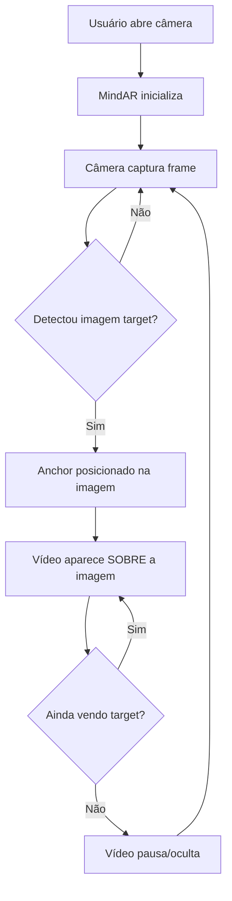

# Plano de Correção: AR Viewer - Posicionamento de Câmera e Vídeo

## Problemas Identificados

Analisando a imagem enviada e o código atual, os seguintes problemas foram identificados:

### 1. Câmera não centralizada na tela
- O container AR pode não estar ocupando corretamente toda a área visível do celular
- Possíveis problemas com viewport e meta tags para dispositivos móveis

### 2. Vídeo aparece ao lado da foto em vez de sobreposto
- O vídeo AR deve aparecer **DENTRO** da imagem target quando detectada
- O posicionamento do elemento `a-video` pode estar incorreto

### 3. Vídeo não fica fixo na foto (tracking instável)
- O vídeo deveria permanecer ancorado na imagem target enquanto ela estiver visível
- Configurações do MindAR podem precisar de ajustes

---

## Análise do Código Atual

### Arquivo: `src/pages/ArViewer.tsx`

```tsx
// Configuração atual do MindAR
scene.setAttribute("mindar-image", 
  `imageTargetSrc: ${experience.mind_file_url}; 
   autoStart: true; 
   filterMinCF: 0.0001; 
   filterBeta: 1000; 
   uiLoading: no; 
   uiError: no; 
   uiScanning: no;`
);

// Posicionamento do vídeo
plane.setAttribute("position", "0 0 0");
plane.setAttribute("width", "1");
plane.setAttribute("height", "0.552");
```

### Arquivo: `src/index.css`

```css
a-scene {
  position: fixed !important;
  inset: 0 !important;
  width: 100vw !important;
  height: 100vh !important;
  z-index: 1 !important;
}
```

---

## Soluções Propostas

### 1. Corrigir Meta Tags no index.html

Adicionar meta tags essenciais para dispositivos móveis:

```html
<meta name="viewport" content="width=device-width, initial-scale=1.0, maximum-scale=1.0, user-scalable=no, viewport-fit=cover" />
<meta name="apple-mobile-web-app-capable" content="yes" />
<meta name="mobile-web-app-capable" content="yes" />
```

### 2. Ajustar CSS do Container AR

Modificar `src/index.css` para garantir que o container AR ocupe toda a tela corretamente:

```css
/* AR Scene fullscreen - Versão corrigida */
a-scene {
  position: fixed !important;
  top: 0 !important;
  left: 0 !important;
  width: 100% !important;
  height: 100% !important;
  z-index: 1 !important;
}

/* Container do AR */
.ar-container {
  position: fixed;
  top: 0;
  left: 0;
  width: 100%;
  height: 100%;
  overflow: hidden;
}

/* Video element dentro do AR */
a-video {
  object-fit: contain !important;
}

/* Canvas do A-Frame */
a-scene canvas {
  width: 100% !important;
  height: 100% !important;
  object-fit: cover !important;
}
```

### 3. Ajustar Configuração do MindAR

Modificar os parâmetros do MindAR para melhor tracking:

```tsx
scene.setAttribute("mindar-image", 
  `imageTargetSrc: ${experience.mind_file_url}; 
   autoStart: true; 
   filterMinCF: 0.001; 
   filterBeta: 100; 
   uiLoading: no; 
   uiError: no; 
   uiScanning: no;`
);
```

**Explicação dos parâmetros:**
- `filterMinCF`: Valor maior (0.001) = mais estabilidade, menos jitter
- `filterBeta`: Valor menor (100) = resposta mais rápida mas menos suave

### 4. Corrigir Posicionamento do Vídeo

O vídeo precisa estar centralizado no anchor e com rotação correta:

```tsx
// Criar o plano de vídeo com posicionamento correto
const plane = document.createElement("a-video");
plane.setAttribute("src", "#ar-video");
plane.setAttribute("width", "1");
plane.setAttribute("height", "0.552");
plane.setAttribute("position", "0 0 0");
plane.setAttribute("rotation", "0 0 0");
plane.setAttribute("scale", "1 1 1");
anchor.appendChild(plane);
```

### 5. Estrutura Correta do A-Frame

A estrutura correta deve ser:

```
a-scene (mindar-image)
├── a-assets
│   └── video#ar-video
├── a-camera (position: 0 0 0)
└── a-entity (mindar-image-target, targetIndex: 0)
    └── a-video (o vídeo que aparece SOBRE a imagem target)
```

---

## Diagrama do Fluxo AR



---

## Arquivos a Modificar

| Arquivo | Modificação |
|---------|-------------|
| `index.html` | Adicionar meta tags para mobile |
| `src/index.css` | Ajustar CSS do a-scene e container |
| `src/pages/ArViewer.tsx` | Ajustar parâmetros MindAR e posicionamento do vídeo |

---

## Próximos Passos

1. Aplicar as correções no código
2. Testar em dispositivo móvel real
3. Verificar se o vídeo aparece corretamente sobre a imagem target
4. Ajustar parâmetros de tracking se necessário
