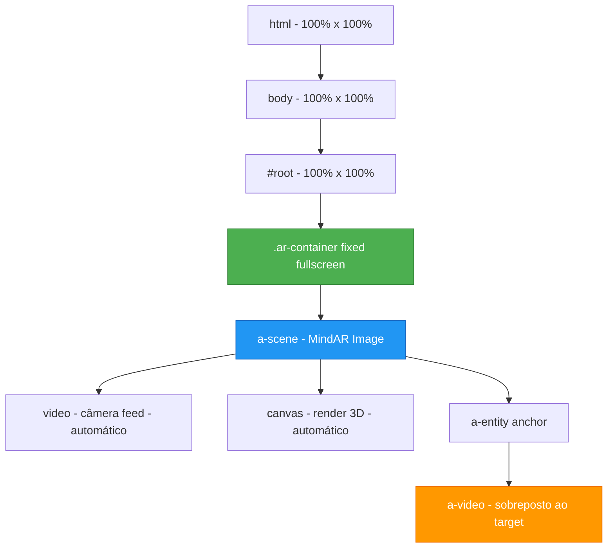

# Plano de Correção V2: Layout do AR Viewer em Modo de Escaneamento

## Análise do Problema Atualizado

### Problemas Identificados na Primeira Tentativa

1. **CSS conflitante**: As regras CSS estão interferindo com o funcionamento interno do MindAR
2. **Seletor `:has()` pode não funcionar**: Nem todos os navegadores suportam `:has()` consistentemente
3. **Posicionamento do vídeo AR**: A rotação `-90 0 0` pode não ser correta para MindAR Image

### Como o MindAR Image Funciona

O MindAR Image cria automaticamente:
1. Um elemento `<video>` para o feed da câmera (background)
2. Um elemento `<canvas>` para renderização 3D
3. O anchor rastreia a imagem target e posiciona o conteúdo 3D

**Importante**: O MindAR já gerencia automaticamente o posicionamento do conteúdo dentro do anchor. O vídeo deve aparecer automaticamente sobreposto ao target quando detectado.

### Causa Raiz Real

O problema principal é que o CSS do `#root` está limitando o container:
- `max-width: 1280px` 
- `padding: 2rem`
- `margin: 0 auto`

Isso faz com que o conteúdo AR não ocupe toda a tela.

---

## Solução Proposta

### Passo 1: Reescrever CSS do AR para não interferir com MindAR

**Arquivo**: `src/index.css`

Remover todas as regras que forçam dimensões em elementos internos do A-Frame/MindAR. O MindAR gerencia isso automaticamente.

```css
/* AR Scene - apenas posicionamento do container principal */
.ar-container,
.ar-container a-scene {
  position: fixed !important;
  top: 0 !important;
  left: 0 !important;
  width: 100vw !important;
  height: 100vh !important;
  margin: 0 !important;
  padding: 0 !important;
  overflow: hidden !important;
}

/* Esconde UI do MindAR */
.mindar-ui-overlay {
  display: none !important;
}
```

### Passo 2: Corrigir App.css - Remover restrições do #root

**Arquivo**: `src/App.css`

O `#root` não deve ter restrições de largura. Usar uma classe específica para páginas normais.

```css
/* Remover restrições do #root - deixar que cada página controle seu layout */
#root {
  width: 100%;
  min-height: 100vh;
  margin: 0;
  padding: 0;
}

/* Container para páginas normais (não-AR) */
.page-container {
  max-width: 1280px;
  margin: 0 auto;
  padding: 2rem;
  text-align: center;
}
```

### Passo 3: Ajustar ArViewer.tsx - Posicionamento Correto do Vídeo

Para MindAR Image, o conteúdo dentro do anchor já é posicionado automaticamente. O vídeo deve:
- Ficar paralelo ao plano da imagem target
- Ter as dimensões da imagem target (ou proporção desejada)

**Código corrigido**:
```tsx
// Create video plane - MindAR Image posiciona automaticamente
const plane = document.createElement("a-video");
plane.setAttribute("src", "#ar-video");
plane.setAttribute("width", "1");
plane.setAttribute("height", "0.5625"); // Proporção 16:9
plane.setAttribute("position", "0 0 0");
plane.setAttribute("rotation", "0 0 0"); // Sem rotação - MindAR controla
plane.setAttribute("scale", "1 1 1");
anchor.appendChild(plane);
```

### Passo 4: Garantir que body e html não tenham restrições

**Arquivo**: `src/index.css`

```css
/* Garantir que body e html ocupem toda a tela */
html, body {
  width: 100%;
  height: 100%;
  margin: 0;
  padding: 0;
  overflow-x: hidden;
}

/* Quando AR ativo, remover qualquer scroll */
body.ar-active {
  overflow: hidden !important;
  position: fixed !important;
  width: 100%;
  height: 100%;
}
```

---

## Diagrama da Estrutura



---

## Arquivos a Modificar

| Arquivo | Mudança |
|---------|---------|
| `src/index.css` | Simplificar CSS do AR, adicionar estilos para html/body |
| `src/App.css` | Remover restrições do #root |
| `src/pages/ArViewer.tsx` | Ajustar rotação do vídeo para 0 0 0 |

---

## Checklist de Implementação

- [ ] Atualizar `src/index.css` - simplificar CSS do AR
- [ ] Atualizar `src/App.css` - remover max-width do #root
- [ ] Atualizar `src/pages/ArViewer.tsx` - rotação do vídeo 0 0 0
- [ ] Testar em dispositivo móvel