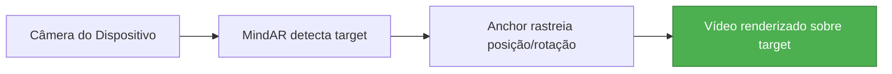

# Plano de Correção V3: Layout do AR Viewer - Orientação e Posicionamento

## Problemas Identificados

1. **Tela não preenche em modo retrato (portrait)**: O container AR funciona em landscape mas não em portrait
2. **Vídeo não fica sobreposto à imagem target**: O vídeo fica "preso" fora da foto em vez de sobreposto

## Análise do MindAR Image

O MindAR Image Target funciona da seguinte forma:
- O sistema detecta a imagem target na câmera
- O `anchor` (entidade com `mindar-image-target`) rastreia a posição/rotação da imagem
- O conteúdo dentro do anchor é renderizado no espaço 3D relativo à imagem detectada

### Problemas no Código Atual

1. **Atributo `embedded`**: Pode estar causando problemas de dimensionamento
2. **Rotação do vídeo**: `rotation="0 0 0"` pode não estar correto para o MindAR Image
3. **CSS interferindo**: Regras CSS podem estar conflitando com o A-Frame/MindAR

## Solução Proposta

### Passo 1: Reescrever CSS do AR para não interferir

O MindAR/A-Frame gerencia seus próprios elementos internos. Não devemos forçar estilos neles.

### Passo 2: Configurar A-Scene corretamente

```tsx
// Remover atributo "embedded" - pode causar problemas
scene.setAttribute("vr-mode-ui", "enabled: false");
scene.setAttribute("device-orientation-permission-ui", "enabled: false");
scene.setAttribute("renderer", "colorManagement: true, physicallyCorrectLights");
scene.setAttribute("embedded", ""); // Manter embedded mas garantir CSS correto
```

### Passo 3: Posicionar vídeo corretamente no espaço 3D

Para MindAR Image, o vídeo precisa:
- Estar paralelo ao plano da imagem target
- Rotação `-90 0 0` para ficar "deitado" sobre o target
- Posição `0 0 0` centralizado no anchor

```tsx
const plane = document.createElement("a-plane"); // Usar a-plane em vez de a-video
plane.setAttribute("src", "#ar-video");
plane.setAttribute("width", "1");
plane.setAttribute("height", "0.5625");
plane.setAttribute("position", "0 0 0");
plane.setAttribute("rotation", "-90 0 0"); // Deitar o plano sobre o target
plane.setAttribute("scale", "1 1 1");
anchor.appendChild(plane);
```

### Passo 4: CSS Final para AR

```css
/* Container AR - fullscreen absoluto */
.ar-container {
  position: fixed !important;
  top: 0 !important;
  left: 0 !important;
  width: 100% !important;
  height: 100% !important;
  margin: 0 !important;
  padding: 0 !important;
  overflow: hidden !important;
}

/* A-Scene ocupa todo o container */
.ar-container a-scene {
  position: absolute !important;
  top: 0 !important;
  left: 0 !important;
  width: 100% !important;
  height: 100% !important;
}

/* Esconder UI do MindAR */
.mindar-ui-overlay {
  display: none !important;
}
```

## Diagrama de Funcionamento



## Arquivos a Modificar

| Arquivo | Mudança |
|---------|---------|
| `src/index.css` | Simplificar CSS do AR |
| `src/pages/ArViewer.tsx` | Usar `a-plane` com rotação `-90 0 0` |

## Checklist

- [ ] Atualizar CSS do AR em `src/index.css`
- [ ] Mudar de `a-video` para `a-plane` em `src/pages/ArViewer.tsx`
- [ ] Aplicar rotação `-90 0 0` no plano
- [ ] Testar em dispositivo móvel (portrait e landscape)