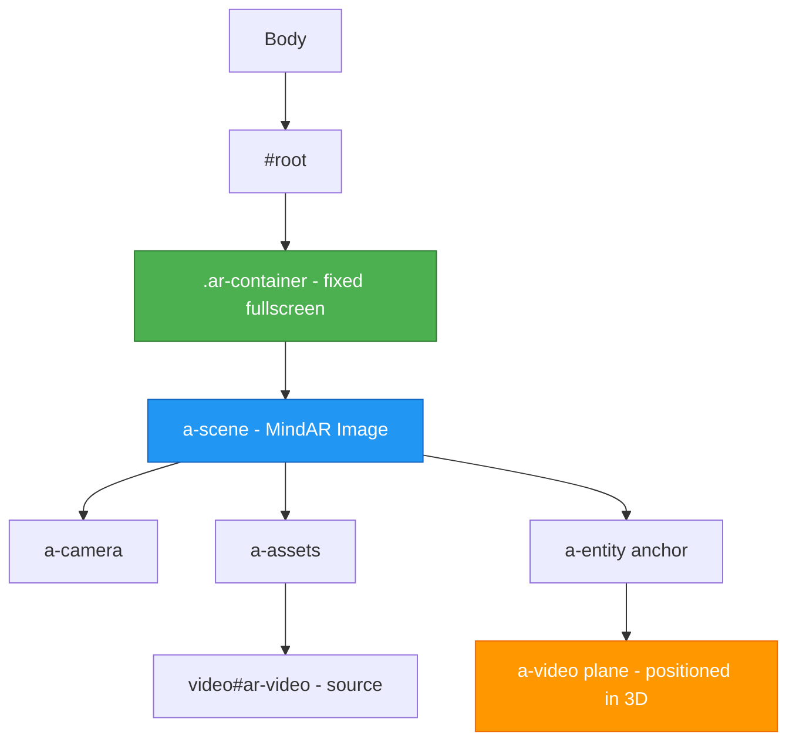
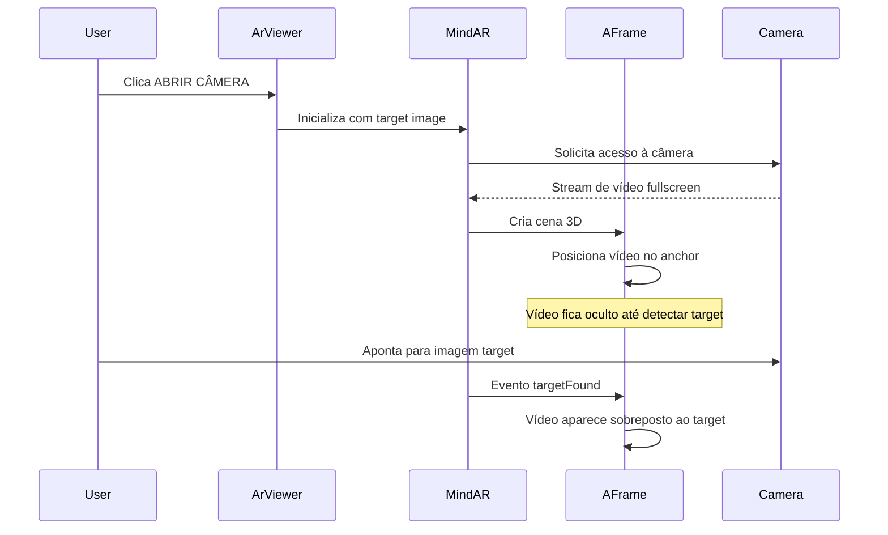

# Plano de Correção: Layout do AR Viewer em Modo de Escaneamento

## Análise do Problema

### Descrição do Erro
Na captura de tela do dispositivo móvel, observa-se que:
1. A tela não está sendo preenchida corretamente
2. O vídeo está sendo renderizado ao lado da imagem da câmera em vez de sobreposto a ela
3. O conteúdo AR não está integrado à área designada

### Causa Raiz Identificada

O problema está no CSS global em [`src/index.css`](src/index.css:131) que afeta **todos** os elementos de vídeo:

```css
/* Linha 131-135 */
video[src] {
  object-fit: cover !important;
  width: 100% !important;
  height: 100% !important;
}
```

Esta regra CSS aplica-se a:
1. O vídeo da câmera do MindAR (que deve preencher a tela como background)
2. O elemento `<a-video>` do A-Frame (que deve ser posicionado dentro da cena 3D)

O seletor `video[src]` é muito genérico e está forçando o vídeo AR a ocupar 100% da tela, quebrando o posicionamento 3D do A-Frame.

### Problemas Adicionais Identificados

1. **Conflito de estilos no App.css**: O [`src/App.css`](src/App.css:1) define `#root` com `max-width: 1280px` e `padding: 2rem`, o que pode restringir o container AR.

2. **Falta de especificidade para o vídeo AR**: O elemento `<a-video>` dentro do A-Frame precisa de estilos específicos que não interfiram com o posicionamento 3D.

---

## Plano de Correção

### Passo 1: Corrigir CSS Global do Vídeo

**Arquivo**: [`src/index.css`](src/index.css:131)

**Ação**: Substituir o seletor genérico `video[src]` por um seletor específico para o vídeo da câmera do MindAR.

**Antes**:
```css
video[src] {
  object-fit: cover !important;
  width: 100% !important;
  height: 100% !important;
}
```

**Depois**:
```css
/* Vídeo da câmera do MindAR - deve preencher toda a tela */
a-scene video {
  object-fit: cover !important;
  width: 100% !important;
  height: 100% !important;
  position: absolute !important;
  top: 0 !important;
  left: 0 !important;
}

/* Vídeo AR dentro do A-Frame - não deve ter dimensões forçadas */
a-video video,
a-video {
  width: auto !important;
  height: auto !important;
  object-fit: contain !important;
}
```

### Passo 2: Ajustar Container AR no App.css

**Arquivo**: [`src/App.css`](src/App.css:1)

**Ação**: Adicionar exceção para rotas de AR Viewer ou remover restrições que afetam fullscreen.

**Adicionar**:
```css
/* Remove restrições para páginas AR em fullscreen */
body:has(.ar-container),
#root:has(.ar-container) {
  max-width: none !important;
  padding: 0 !important;
  margin: 0 !important;
  width: 100vw !important;
  height: 100vh !important;
  overflow: hidden !important;
}
```

### Passo 3: Reforçar Estilos do Container AR

**Arquivo**: [`src/index.css`](src/index.css:109)

**Ação**: Garantir que o container AR e seus filhos não herdam restrições.

**Atualizar seção existente**:
```css
/* Container do AR - garante fullscreen */
.ar-container {
  position: fixed !important;
  top: 0 !important;
  left: 0 !important;
  width: 100vw !important;
  height: 100vh !important;
  overflow: hidden !important;
  margin: 0 !important;
  padding: 0 !important;
  box-sizing: border-box !important;
}

.ar-container * {
  box-sizing: border-box !important;
}
```

### Passo 4: Ajustar Posicionamento do Vídeo no A-Frame

**Arquivo**: [`src/pages/ArViewer.tsx`](src/pages/ArViewer.tsx:88)

**Ação**: Revisar os atributos do plano de vídeo para garantir dimensionamento correto.

**Código atual** (linhas 88-96):
```tsx
const plane = document.createElement("a-video");
plane.setAttribute("src", "#ar-video");
plane.setAttribute("width", "1");
plane.setAttribute("height", "0.552");
plane.setAttribute("position", "0 0 0");
plane.setAttribute("rotation", "0 0 0");
plane.setAttribute("scale", "1 1 1");
```

**Ajustar para**:
```tsx
const plane = document.createElement("a-video");
plane.setAttribute("src", "#ar-video");
plane.setAttribute("width", "1");
plane.setAttribute("height", "0.5625"); // Proporção 16:9
plane.setAttribute("position", "0 0 0.01"); // Ligeiramente à frente do target
plane.setAttribute("rotation", "-90 0 0"); // Rotacionar para ficar paralelo ao chão/target
plane.setAttribute("scale", "1 1 1");
plane.setAttribute("visible", "true");
```

### Passo 5: Adicionar Meta Viewport para Mobile

**Arquivo**: [`index.html`](index.html)

**Ação**: Verificar se o viewport está configurado corretamente para evitar zoom/scroll.

**Verificar presença de**:
```html
<meta name="viewport" content="width=device-width, initial-scale=1.0, maximum-scale=1.0, user-scalable=no, viewport-fit=cover">
```

---

## Diagrama da Estrutura Corrigida



---

## Fluxo de Renderização Esperado



---

## Arquivos a Modificar

| Arquivo | Tipo de Mudança | Prioridade |
|---------|-----------------|------------|
| `src/index.css` | Correção de CSS | Alta |
| `src/App.css` | Adicionar exceção | Alta |
| `src/pages/ArViewer.tsx` | Ajuste de atributos A-Frame | Média |
| `index.html` | Verificação de viewport | Baixa |

---

## Checklist de Implementação

- [ ] Aplicar correção no `src/index.css` - seletor de vídeo específico
- [ ] Aplicar correção no `src/App.css` - exceção para AR container
- [ ] Atualizar estilos do `.ar-container` no `src/index.css`
- [ ] Ajustar atributos do `a-video` no `src/pages/ArViewer.tsx`
- [ ] Verificar/adicionar meta viewport no `index.html`
- [ ] Testar em dispositivo móvel
- [ ] Validar comportamento em diferentes tamanhos de tela

---

## Notas Adicionais

1. **Teste em dispositivo real**: O AR só funciona corretamente em dispositivos móveis com câmera. Testar em iOS e Android.

2. **Debug**: Para debugar em dispositivo móvel, usar Chrome DevTools com USB debugging ou Safari Web Inspector para iOS.

3. **MindAR Image Target**: Certificar-se de que o arquivo `.mind` está sendo carregado corretamente e que a imagem target tem qualidade suficiente para detecção.