# Plano de Correção: Performance e Responsividade Mobile

## Problemas Identificados

Com base na análise do código e do texto fornecido, os seguintes problemas foram identificados:

### 1. AR Viewer - Problemas de Renderização

| Problema | Causa | Impacto |
|----------|-------|---------|
| Tela torta/deformada | Falta de `object-fit` e aspect-ratio adequados | Vídeo esticado ou achatado |
| Vídeo não fixo na foto | Uso de `a-video` em vez de `a-plane` com rotação correta | Vídeo "flutuando" fora do target |
| Não funciona em portrait | CSS não adaptado para orientação mobile | Tela cortada ou mal dimensionada |

### 2. CSS - Problemas de Responsividade

| Problema | Local | Solução |
|----------|-------|---------|
| `overflow: hidden` global | `index.css` linha 97 | Remover ou tornar condicional |
| Falta de media queries | Global | Adicionar breakpoints para mobile |
| Elementos com largura fixa | Vários componentes | Usar viewport units e porcentagens |

### 3. Performance

| Problema | Causa | Solução |
|----------|-------|---------|
| Carregamento de scripts AR | Scripts externos no `index.html` | Pré-carregar ou usar dynamic import |
| Imagens sem lazy loading | Index.tsx galeria | Já implementado, verificar outras páginas |

---

## Solução Proposta

### Fase 1: Correção do CSS Global

#### 1.1 Remover `overflow: hidden` global

```css
/* ANTES - Problemático */
html, body {
  overflow: hidden !important;
}

/* DEPOIS - Apenas quando necessário */
html, body {
  width: 100%;
  height: 100%;
  margin: 0;
  padding: 0;
}

/* Manter overflow hidden apenas no modo AR */
body.ar-active {
  overflow: hidden !important;
  position: fixed !important;
  width: 100% !important;
  height: 100% !important;
}
```

#### 1.2 Adicionar CSS para AR responsivo

```css
/* AR Container - funciona em qualquer orientação */
.ar-container {
  position: fixed !important;
  top: 0 !important;
  left: 0 !important;
  width: 100vw !important;
  height: 100vh !important;
  height: 100dvh !important; /* Dynamic viewport height para mobile */
  margin: 0 !important;
  padding: 0 !important;
  overflow: hidden !important;
  z-index: 1 !important;
}

/* A-Scene responsivo */
.ar-container a-scene,
.ar-scene {
  position: absolute !important;
  top: 0 !important;
  left: 0 !important;
  width: 100% !important;
  height: 100% !important;
  margin: 0 !important;
  padding: 0 !important;
}

/* Vídeo AR com aspect-ratio correto */
.ar-container video,
.ar-container a-video,
.ar-container a-plane {
  object-fit: cover !important;
}
```

#### 1.3 Media queries para mobile

```css
/* Mobile - Portrait */
@media screen and (max-width: 640px) and (orientation: portrait) {
  /* Ajustes específicos para mobile portrait */
}

/* Mobile - Landscape */
@media screen and (max-width: 640px) and (orientation: landscape) {
  /* Ajustes para mobile landscape */
}

/* Tablets */
@media screen and (min-width: 641px) and (max-width: 1024px) {
  /* Ajustes para tablets */
}
```

---

### Fase 2: Correção do ArViewer.tsx

#### 2.1 Mudar de `a-video` para `a-plane`

O elemento `a-video` do A-Frame tem comportamento diferente do `a-plane`. Para MindAR Image Target, o `a-plane` é mais adequado.

```tsx
// ANTES
const plane = document.createElement("a-video");
plane.setAttribute("src", "#ar-video");
plane.setAttribute("width", "1");
plane.setAttribute("height", "0.5625");
plane.setAttribute("position", "0 0 0.01");
plane.setAttribute("rotation", "-90 0 0");

// DEPOIS
const plane = document.createElement("a-plane");
plane.setAttribute("src", "#ar-video");
plane.setAttribute("width", "1");
plane.setAttribute("height", "0.5625");
plane.setAttribute("position", "0 0 0");
plane.setAttribute("rotation", "-90 0 0");
plane.setAttribute("material", "shader: flat; src: #ar-video");
```

#### 2.2 Adicionar atributos de vídeo para mobile

```tsx
videoEl.setAttribute("playsinline", "");      // iOS
videoEl.setAttribute("webkit-playsinline", ""); // iOS antigo
videoEl.setAttribute("x5-video-player-type", "h5"); // WeChat/Android
videoEl.setAttribute("x5-video-player-fullscreen", "true"); // Android
```

#### 2.3 Melhorar configuração do MindAR

```tsx
scene.setAttribute(
  "mindar-image",
  `imageTargetSrc: ${experience.mind_file_url}; 
   autoStart: true; 
   filterMinCF: 0.0001; 
   filterBeta: 0.001; 
   uiLoading: no; 
   uiError: no; 
   uiScanning: no;`
);
```

---

### Fase 3: Responsividade das Páginas

#### 3.1 Index.tsx - Já parcialmente responsivo

Melhorias necessárias:
- Ajustar tamanhos de fonte para mobile
- Melhorar espaçamento do hero section
- Otimizar grid de experiências

#### 3.2 Upload.tsx - Verificar e corrigir

- Adicionar padding adequado para mobile
- Verificar se dropzones funcionam em touch
- Ajustar tamanhos de botões

#### 3.3 History.tsx - Verificar e corrigir

- Layout responsivo para lista de experiências
- Botões touch-friendly

---

## Diagrama de Arquitetura

```mermaid
graph TB
    subgraph Mobile Browser
        A[Viewport] --> B[CSS Media Queries]
        B --> C[Layout Responsivo]
    end
    
    subgraph AR Mode
        D[ArViewer.tsx] --> E[MindAR Image]
        E --> F[Detecção de Target]
        F --> G[a-plane com vídeo]
        G --> H[Overlay na imagem]
    end
    
    subgraph CSS Layers
        I[Base CSS] --> J[AR Container]
        J --> K[A-Scene]
        K --> L[Video/Plane]
    end
    
    style H fill:#4CAF50,stroke:#2E7D32,color:#fff
    style C fill:#2196F3,stroke:#1565C0,color:#fff
```



---

## Arquivos a Modificar

| Arquivo | Mudanças | Prioridade |
|---------|----------|------------|
| `src/index.css` | Reescrever CSS do AR, adicionar media queries | Alta |
| `src/pages/ArViewer.tsx` | Mudar para a-plane, adicionar atributos mobile | Alta |
| `src/pages/Index.tsx` | Ajustar responsividade | Média |
| `src/pages/Upload.tsx` | Verificar e ajustar responsividade | Média |
| `src/pages/History.tsx` | Verificar e ajustar responsividade | Baixa |

---

## Checklist de Implementação

### CSS (src/index.css)
- [ ] Remover `overflow: hidden` global de html/body
- [ ] Adicionar `100dvh` para mobile viewport
- [ ] Adicionar media queries para mobile portrait/landscape
- [ ] Melhorar CSS do AR container
- [ ] Adicionar `object-fit: cover` para vídeos

### ArViewer.tsx
- [ ] Mudar de `a-video` para `a-plane`
- [ ] Adicionar atributos mobile para vídeo
- [ ] Configurar material shader flat
- [ ] Verificar rotação e posicionamento

### Páginas
- [ ] Verificar Index.tsx responsividade
- [ ] Verificar Upload.tsx responsividade
- [ ] Verificar History.tsx responsividade

### Testes
- [ ] Testar em Chrome mobile (dev tools)
- [ ] Testar em Safari iOS (se possível)
- [ ] Testar em diferentes tamanhos de tela
- [ ] Testar orientação portrait e landscape
- [ ] Testar funcionalidade AR completa

---

## Notas Adicionais

### Sobre o MindAR Image Target

O MindAR Image Target funciona da seguinte forma:
1. A câmera do dispositivo captura o ambiente
2. O sistema detecta a imagem target (arquivo .mind)
3. Um anchor é criado na posição da imagem detectada
4. O conteúdo dentro do anchor é renderizado no espaço 3D

Para o vídeo aparecer corretamente sobre a imagem:
- O plano precisa estar paralelo à imagem (rotação -90 em X)
- A posição Z=0 coloca o vídeo exatamente sobre o target
- O aspect-ratio deve corresponder ao vídeo original

### Sobre Viewport Mobile

A unidade `dvh` (dynamic viewport height) é importante para mobile porque:
- `100vh` não considera a barra de endereços do navegador
- `100dvh` ajusta automaticamente quando a barra aparece/desaparece
- Suporte: iOS 15.4+, Chrome 108+
