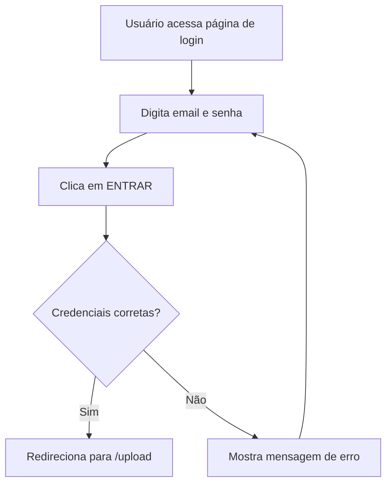

# Plano: Mudar Login de Magic Link para Email/Senha

## Requisitos

1. Mudar de Magic Link para login com email/senha
2. Apenas emails já cadastrados podem entrar
3. Não permitir cadastro pelo site (sem signup)

## Análise Atual

### Arquivo: `src/pages/Auth.tsx`
- Usa `supabase.auth.signInWithOtp()` para Magic Link
- Mostra tela de "verifique seu email" após envio
- Não tem campo de senha

### Arquivo: `src/contexts/AuthContext.tsx`
- Gerencia sessão do Supabase
- Não precisa de alterações

## Mudanças Necessárias

### 1. Modificar `Auth.tsx`

**Antes (Magic Link):**
```tsx
const { error } = await supabase.auth.signInWithOtp({
  email,
  options: { emailRedirectTo: window.location.origin + "/upload" },
});
```

**Depois (Email/Senha):**
```tsx
const { error } = await supabase.auth.signInWithPassword({
  email,
  password,
});
```

### 2. Alterações na Interface

- Adicionar campo de senha
- Remover tela de "verifique seu email"
- Atualizar textos e mensagens
- Mostrar erro quando email não está cadastrado

### 3. Configuração do Supabase

O Supabase precisa estar configurado para:
- Habilitar login por email/senha
- Desabilitar signup público (opcional, pode ser controlado pelas mensagens de erro)

## Fluxo de Login



## Mensagens de Erro

- Email não cadastrado: "Este email não está cadastrado."
- Senha incorreta: "Senha incorreta."
- Campos vazios: "Preencha todos os campos."

## Arquivos a Modificar

| Arquivo | Modificação |
|---------|-------------|
| `src/pages/Auth.tsx` | Mudar para login email/senha |

## Próximos Passos

1. Implementar as mudanças no Auth.tsx
2. Testar o fluxo de login
